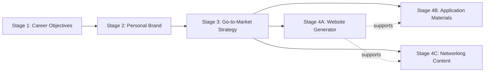
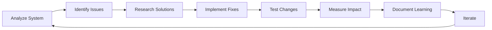

# Request to Prompt Engineering Assistant

> **Context**: This prompt will be executed by the [Prompt Engineering Assistant](https://github.com/Modular-Earth-LLC/AI-engineering-assistant/blob/main/prompt_engineering_assistant.system.prompt.md) custom agent in Cursor to analyze and optimize the job-finding assistant system.

I need you to analyze and optimize my comprehensive **6-assistant job-finding system** using your advanced prompt engineering capabilities and 4-step methodology. This is a multi-agent AI architecture with sequential stages and shared knowledge base that needs validation and enhancement.

## What I Need You to Do

**Primary Goal**: Optimize the job-finding workflow for maximum effectiveness in helping users land jobs aligned with their strategy and goals.

**Specific Tasks**:

1. Analyze all 6 AI assistant prompts for coherence, dependencies, and redundancies
2. Validate knowledge base CRUD operations and data flow integrity
3. Ensure strategic alignment across all workflow stages
4. Eliminate redundancy while preserving functionality
5. Apply latest prompt engineering research to improve effectiveness
6. Update all repository documentation to reflect current system state

**Expected Outcome**: A seamless, efficient workflow that converts strategic foundation (Stages 1-3) into tactical execution (Stages 4A/4B/4C) that generates job offers.

## System Context & Configuration

### Files to Analyze

Please analyze all **6 AI assistant system prompts** in this repository:

- `AI_assistants/career_coach_assistant.system.prompt.md` (Stage 1)
- `AI_assistants/personal_brand_development_assistant.system.prompt.md` (Stage 2)
- `AI_assistants/job_market_positioning.system.prompt.md` (Stage 3)
- `AI_assistants/professional_website_generator.system.prompt.md` (Stage 4A)
- `AI_assistants/job_application_interview_assistant.system.prompt.md` (Stage 4B)
- `AI_assistants/professional_networking_assistant.system.prompt.md` (Stage 4C)

### Supporting Configuration Files

- **Knowledge Base**: `inputs/knowledge-bases/job_search_knowledge_base.json`
- **System Configuration**: `inputs/knowledge-bases/ai_assistants_system_config.json`
- **KB Management Guide**: `inputs/knowledge-bases/knowledge_base_management_guide.md`

### Documentation Files to Update

- `README.md` - User-facing overview and quick start
- `INSTALLATION_GUIDE.md` - Platform-specific setup instructions
- `AI_assistants/system_prompts_guide.md` - Technical architecture documentation

### Optimization Preferences

**Primary Focus**: Comprehensive optimization ("all" aspects)

- Workflow coherence across all 6 assistants
- Stage prerequisite validation
- Redundancy elimination (leverage shared config)
- Performance and user experience
- Documentation accuracy

**Change Management**: Use 15% threshold for major vs. minor changes

**Target Platforms**: All supported (ChatGPT, Claude, Mistral)

## What Success Looks Like

When you've successfully optimized this system, it should achieve:

### System-Level Success Indicators

✓ **Stage Dependencies Validated**: Each stage properly checks prerequisites before execution  
✓ **Knowledge Base Integrity**: Data flows correctly between stages without corruption  
✓ **Zero Redundancy**: No duplicate data collection or conflicting instructions  
✓ **Strategic Alignment**: All outputs align with career objectives and personal brand  
✓ **Platform Compatibility**: Works seamlessly across ChatGPT, Claude, and Mistral  
✓ **Measurable Outcomes**: Content generates responses and advances toward job offers
✓ **Website Integration**: Stage 4A properly transforms GTM strategy into portfolio websites
✓ **Shared Configuration**: All assistants reference `ai_assistants_system_config.json` consistently

### Stage-Specific Outcomes

- **Stage 1 (Career Coach)**: Clear objectives documented with timeline and constraints
- **Stage 2 (Personal Brand)**: Authentic brand elements aligned with career goals
- **Stage 3 (Market Positioning)**: Data-driven strategy with target roles and positioning
- **Stage 4A (Website Generator)**: Portfolio website that converts visits to interviews
- **Stage 4B (Application Assistant)**: ATS-optimized content with 95%+ keyword match rates
- **Stage 4C (Networking Assistant)**: Networking messages with high response rates

## Background: System Architecture

### Current Workflow Design

My job-finding system operates as a sequential, dependent workflow with 6 specialized assistants:



**Critical Dependencies**:

- Stages 1-3 must complete in sequence
- Stage 4 assistants (4A, 4B, 4C) can run in any order after Stage 3
- Stage 4A website enhances 4B/4C effectiveness but is not required

### Knowledge Base CRUD Architecture

Each assistant has specific permissions defined in `ai_assistants_system_config.json`:

| Assistant | Stage | Read Permissions | Write Permissions |
|-----------|-------|------------------|-------------------|
| Career Coach | 1 | user_profile, career_objectives | user_profile.basic_info, career_objectives |
| Personal Brand | 2 | career_objectives, user_profile, personal_brand, user_personality | personal_brand, user_personality |
| Market Positioning | 3 | All strategic sections | go_to_market_strategy |
| Website Generator | 4A | All sections | website_configuration |
| Application Assistant | 4B | All sections (read-only) | None |
| Networking Assistant | 4C | All sections (read-only) | None |

**Critical Validation Points**:

- No assistant writes outside their designated sections
- All Stage 4 assistants validate Stages 1-3 completion before proceeding
- Shared configuration enforces consistent behavior across all assistants

### Prompt Engineering Techniques to Apply

Please leverage these evidence-based techniques from recent research:

1. **Chain-of-Thought Prompting** (Wei et al., 2022): Structure multi-step reasoning
2. **Tree-of-Thoughts** (Yao et al., 2023): Explore multiple solution paths
3. **Self-Consistency** (Wang et al., 2022): Validate through multiple reasoning paths
4. **Progressive-Hint Prompting** (Zheng et al., 2023): Iterative refinement
5. **MODP (Multi-Objective Directional Prompting)**: 26% improvement in task completion
6. **Positive Instruction Framing**: Use "DO this" instead of "DON'T do that" for clarity

## Analysis Requirements

Please conduct your analysis following your standard 4-step methodology. Here are the key areas I need you to focus on:

### Focus Area 1: System Analysis and Dependency Mapping

**What I Need Here**: Comprehensive analysis across all 6 assistants to identify:

**Multi-Agent System Audit**:

- Each assistant's role, stage, and dependencies
- Knowledge base read/write permissions for each
- Prerequisite validation logic across stages
- Error handling protocols and consistency

**Shared Configuration Validation**:

- Compare each assistant's workflow context with `ai_assistants_system_config.json`
- Verify CRUD permissions match configuration
- Check for consistent reference to shared standards
- Identify any divergence from system architecture

**Cross-Assistant Dependencies**: Map the complete dependency graph

```python
dependency_validation = {
    "stage_1": {"requires": [], "provides": ["career_objectives", "user_profile.basic_info"]},
    "stage_2": {"requires": ["career_objectives"], "provides": ["personal_brand", "user_personality"]},
    "stage_3": {"requires": ["career_objectives", "personal_brand"], "provides": ["go_to_market_strategy"]},
    "stage_4a": {"requires": ["go_to_market_strategy", "personal_brand", "career_objectives"], "provides": ["website_configuration", "website_content"]},
    "stage_4b": {"requires": ["go_to_market_strategy", "personal_brand", "career_objectives"], "provides": ["application_materials"]},
    "stage_4c": {"requires": ["go_to_market_strategy", "personal_brand", "career_objectives"], "provides": ["networking_content"]}
}
```

**Dependency Validation Checklist**:

Please verify each stage properly validates prerequisites:

- [ ] Stage 1: No prerequisites (entry point)
- [ ] Stage 2: Checks for career_objectives existence
- [ ] Stage 3: Checks for career_objectives AND personal_brand
- [ ] Stage 4A: Validates GTM strategy, personal brand, career objectives
- [ ] Stage 4B: Validates GTM strategy, personal brand, career objectives
- [ ] Stage 4C: Validates GTM strategy, personal brand, career objectives
- [ ] All assistants handle missing prerequisites with clear user guidance
- [ ] Error messages reference shared configuration protocols

### Focus Area 2: Strategic Alignment Validation

**What I Need Here**: Validation that data flows correctly and strategically aligns across all stages.

**Knowledge Base Flow Analysis** - Please trace data flow through the complete workflow:

**Foundation Building (Stages 1-3)**:

```
Stage 1 OUTPUT → career_objectives, user_profile.basic_info
         ↓
Stage 2 INPUT → career_objectives
Stage 2 OUTPUT → personal_brand, user_personality
         ↓
Stage 3 INPUT → career_objectives, personal_brand
Stage 3 OUTPUT → go_to_market_strategy
         ↓
Stage 4 INPUT → ALL_PREVIOUS_OUTPUTS
```

**Validation Checkpoints**:

1. Career objectives inform personal brand development
2. Personal brand aligns with career objectives
3. GTM strategy reflects both objectives and brand
4. Website content executes GTM messaging frameworks
5. Application materials leverage GTM positioning
6. Networking messages use GTM audience frameworks

**Website Generator Integration** - Stage 4A requires special attention as the newest component.

Please validate these critical points:

- [ ] Receives `go_to_market_strategy.competitive_positioning` for hero section
- [ ] Uses `go_to_market_strategy.messaging_framework` for audience-specific content
- [ ] Integrates `personal_brand.mission` and `personal_brand.vision` authentically
- [ ] Leverages `user_profile.core_skills` aligned with target roles
- [ ] Writes only to `website_configuration` section
- [ ] Provides platform-specific Markdown output (Notion, Eleventy, Jekyll, Astro)
- [ ] Maintains conversion focus (visits → interviews → offers)

**Strategic Coherence Testing** - Please use Tree-of-Thoughts to explore multiple validation paths:

1. **Path A - Data Consistency**:
   - Trace career objectives through all stages
   - Verify brand elements appear in GTM and Stage 4 outputs
   - Check for contradictions or misalignments

2. **Path B - Alignment Check**:
   - Do personal brand elements support career goals?
   - Does GTM strategy target objectives-aligned roles?
   - Do Stage 4 outputs position for target outcomes?

3. **Path C - Narrative Coherence**:
   - Mission/vision consistency from Stage 2 → 4
   - Values reflected in messaging and positioning
   - Authentic voice maintained across all content

4. **Convergence Point**:
   - Determine most efficient validation order
   - Flag dependencies that must be sequential
   - Document validation completion criteria

### Focus Area 3: Redundancy Elimination

**What I Need Here**: Identify and eliminate redundant content while preserving all functionality.

**Redundancy Classification Framework**:

| Type | Severity | Example | Desired Resolution |
|------|----------|---------|------------|
| Critical | 🔴 | Conflicting instructions across assistants | Immediate fix - align with shared config |
| Major | 🟡 | Duplicate data collection in multiple stages | Consolidate in earliest appropriate stage |
| Minor | 🟢 | Repeated context that could reference shared config | Update to reference system configuration |
| Information | ℹ️ | Necessary repetition for clarity | Document rationale, keep as-is |

**Common Patterns to Check**:

- Platform compatibility explanations (should reference shared config)
- Audience frameworks (should reference shared config)
- Error handling protocols (should reference shared config)
- Knowledge base operation instructions (should reference shared config)
- Communication standards (should reference shared config)

**Optimization Approach** - Please apply MODP (Multi-Objective Directional Prompting):

- **Objective 1**: Eliminate redundancy → More maintainable system
- **Objective 2**: Maintain functionality → No capability loss
- **Objective 3**: Improve clarity → Better user experience
- **Direction**: Optimize for job search success rate and system maintainability

**Recommended Strategy**:

1. Move common patterns to `ai_assistants_system_config.json`
2. Update assistants to reference shared configuration
3. Preserve unique, stage-specific guidance
4. Test that functionality remains intact

### Focus Area 4: Prerequisites Enforcement

**What I Need Here**: Ensure all Stage 4 assistants (4A, 4B, 4C) properly validate prerequisites before proceeding.

**Required Validation Logic Example**:

```python
def validate_stage_4_prerequisites():
    """
    Ensure Stage 4 assistants properly validate prerequisites
    """
    
    required_sections = {
        "career_objectives": ["objectives_by_category", "timeline_constraints"],
        "personal_brand": ["mission", "vision", "core_values"],
        "go_to_market_strategy": ["target_markets", "competitive_positioning", "messaging_framework"]
    }
    
    missing_sections = []
    
    for section, required_fields in required_sections.items():
        if not knowledge_base.has_section(section):
            missing_sections.append(f"Complete {section} missing - run Stage {get_stage_number(section)} first")
        else:
            for field in required_fields:
                if not knowledge_base.has_field(section, field):
                    missing_sections.append(f"{section}.{field} incomplete")
    
    if missing_sections:
        return PrerequisiteError(missing_sections)
    
    return ValidationSuccess()
```

**Graceful Degradation** - When prerequisites are incomplete, assistants should:

**Notify User Clearly** (Example):

```
⚠️ **Prerequisites Not Complete**

To create [Stage 4 output], I need:
- ❌ Career objectives (Stage 1) - Missing
- ✅ Personal brand (Stage 2) - Complete  
- ❌ Go-to-market strategy (Stage 3) - Partial (missing messaging_framework)

**Recommended Path**: Complete Stage 1 and finish Stage 3 first for best results.
```

**Then Provide Options**:

1. **Complete missing stages first** (recommended) - Links to appropriate assistants
2. **Provide information now** - Gather minimum required context through conversation
3. **Proceed with limitations** - Explain quality/effectiveness impact

**And Track Impact**: Document how missing data affects output quality and success probability

### Focus Area 5: Platform-Specific Optimization

**What I Need Here**: Ensure prompts work optimally across ChatGPT, Claude, and Mistral.

**Platform Capabilities Reference**:

| Platform | Strengths | Optimization Opportunities | Config Reference |
|----------|-----------|---------------|------------------------|
| OpenAI GPT | Code interpreter, web browsing, DALL-E | Leverage for market research, data analysis | See system config: platform_compatibility |
| Anthropic Claude | 200k context, excellent retention | Use for complex GTM strategies, website content | See system config: platform_compatibility |
| Mistral | Efficient, multilingual, good free tier | Optimize for speed and clarity | See system config: platform_compatibility |

**Cross-Platform Compatibility** - Please ensure prompts work across all platforms:

- ✅ Conversational mode as primary operation (works everywhere)
- ✅ Knowledge base as optional enhancement (specialized environments only)
- ✅ Copy-paste data sharing between stages (universal fallback)
- ✅ Platform detection and graceful adaptation
- ✅ Consistent behavior through shared configuration

**Validation Checklist**:

- [ ] Each assistant specifies conversational mode as primary
- [ ] Knowledge base operations marked as optional/specialized
- [ ] Error handling for missing file access
- [ ] Clear user guidance for cross-assistant data sharing
- [ ] Platform-specific features noted as enhancements, not requirements

### Focus Area 6: Quality Assurance and Testing

**What I Need Here**: Comprehensive testing to ensure optimizations preserve functionality and improve effectiveness.

**Self-Consistency Validation** - Please run multiple reasoning paths to ensure robust optimization:

**Test Scenario 1: Complete Workflow**

- Path 1: User completes Stages 1-3, then 4A → 4B → 4C
- Path 2: User completes Stages 1-3, then 4B → 4C → 4A  
- Path 3: User completes Stages 1-3, then only 4B
- Validation: All paths produce consistent, high-quality outputs

**Test Scenario 2: Missing Prerequisites**

- Path 1: User jumps to Stage 4B without completing Stage 3
- Path 2: User completes Stage 1 and 3, skips Stage 2
- Path 3: User completes Stage 2 and 3, skips Stage 1
- Validation: All paths provide clear guidance to complete missing stages

**Test Scenario 3: Knowledge Base Modes**

- Path 1: Full KB access, all stages completed sequentially
- Path 2: Conversational mode, data shared via copy-paste
- Path 3: Mixed mode (some with KB, some conversational)
- Validation: All paths achieve same strategic outcomes

**Progressive-Hint Testing** - Please iteratively refine optimizations through staged testing:

**Round 1: Basic Functionality**

- Test each assistant independently
- Verify core capabilities intact
- Check knowledge base read/write permissions

**Round 2: Integration Testing**

- Test sequential workflow (Stages 1→2→3→4)
- Verify data flows correctly between stages
- Validate prerequisite checking

**Round 3: Edge Case Testing**

- Test with incomplete data
- Test with conflicting inputs
- Test platform-specific scenarios

**Round 4: Real-World Simulation**

- Test complete job search workflow
- Measure output quality and effectiveness
- Validate against success criteria

**Website Generator Testing** - Stage 4A requires additional validation as newest component.

Please check these content quality aspects:

- [ ] GTM strategy messaging accurately translated to website
- [ ] Personal brand narratives integrated authentically
- [ ] Competitive differentiation clearly communicated
- [ ] Platform-specific Markdown syntax correct (Notion, Eleventy, Jekyll, Astro)
- [ ] Conversion focus maintained (visits → interviews)

**Integration Tests**:

- [ ] Website content supports application materials (4B)
- [ ] Website complements networking outreach (4C)
- [ ] All links and references valid
- [ ] Mobile-responsive structure

## Important Guidelines & Constraints

### What to Preserve and Prioritize

**Please DO:**

- ✅ Preserve all existing functionality
- ✅ Maintain clear stage boundaries
- ✅ Ensure backward compatibility
- ✅ Document all changes clearly
- ✅ Test with real job search scenarios
- ✅ Leverage shared configuration for consistency
- ✅ Use positive instruction framing ("DO this" not "DON'T do that")
- ✅ Apply latest prompt engineering research

**Please AVOID:**

- ❌ Merging stages (reduces modularity)
- ❌ Breaking existing workflows
- ❌ Creating circular dependencies
- ❌ Removing safety checks
- ❌ Ignoring platform limitations
- ❌ Duplicating information that could reference shared config
- ❌ Creating conflicting instructions across assistants

### Change Management Preferences

**For Minor Changes (< 15% of content)**:

- Direct implementation with documentation
- Update change log with rationale
- Test basic functionality
- Quick validation of affected components

**For Major Changes (≥ 15% of content)**:

- Please present comprehensive analysis with metrics first
- Wait for my explicit approval before implementing
- Implement incrementally with checkpoints
- Full regression testing across all 6 assistants
- Document rollback procedure

## Deliverables I Need

### 1. System Analysis Summary

```markdown
## Workflow System Analysis
**Date**: [Current Date]
**Analyzer**: Job Finding Workflow Optimizer
**System Version**: 3.0 (6 assistants)

### System Overview
├── Total Assistants: 6
├── Workflow Stages: 4 (with 4A/4B/4C parallel execution)
├── Knowledge Base Sections: 7 (user_profile, career_objectives, personal_brand, user_personality, go_to_market_strategy, website_configuration, document_library)
└── Platform Targets: ChatGPT, Claude, Mistral

### Dependency Analysis
├── ✅ Valid Dependencies: [count] - [examples]
├── ⚠️ Weak Dependencies: [count] - [examples]
├── ❌ Missing Dependencies: [count] - [examples]
└── ℹ️ Website Generator Integration: [status]

### Shared Configuration Alignment
├── ✅ Consistent References: [count]
├── ⚠️ Inconsistent Usage: [count]
└── ❌ Missing References: [count]

### Optimization Opportunities
├── 🔴 Critical Issues: [count] - [examples with impact]
├── 🟡 Major Improvements: [count] - [examples with benefit]
├── 🟢 Minor Enhancements: [count] - [examples]
└── ℹ️ Documentation Updates: [count] - [examples]
```

### 2. Prerequisites Validation Report

```markdown
## Prerequisites Validation
**Stage 4 Readiness**: [READY/NOT READY/PARTIAL]

### Required Prerequisites
**For All Stage 4 Assistants (4A/4B/4C)**:
- [ ] Career Objectives (Stage 1): [Complete/Incomplete/Missing] - [specific fields]
- [ ] Personal Brand (Stage 2): [Complete/Incomplete/Missing] - [specific fields]
- [ ] Market Strategy (Stage 3): [Complete/Incomplete/Missing] - [specific fields]

### Knowledge Base Integrity
- [ ] Data Structure: [Valid/Invalid] - [issues if any]
- [ ] Required Fields: [Complete/Incomplete] - [missing fields]
- [ ] Cross-References: [Consistent/Inconsistent] - [conflicts if any]
- [ ] Write Permissions: [Properly Scoped/Conflicts Detected]

### Website Generator Specific
- [ ] GTM Messaging Frameworks: [Available/Missing]
- [ ] Competitive Positioning: [Available/Missing]
- [ ] Platform Selection: [Specified/Not Specified]
- [ ] Website Configuration Section: [Exists/Needs Creation]
```

### 3. Optimization Implementation Plan

```markdown
## Implementation Plan

### Phase 1: Immediate Actions (Week 1)

**Critical Fixes** (if any):
1. [Specific issue] → [Fix] → [Expected impact]
2. [Configuration alignment] → [Update] → [Consistency improvement]

**Priority Improvements**:
1. [Optimization] → [Implementation] → [Benefit]
2. [Testing protocol] → [Validation method] → [Success metric]

### Phase 2: Strategic Improvements (Weeks 2-4)

**Long-term Enhancements**:
1. [Enhancement strategy] → [Rollout plan] → [Measurement]
2. [Documentation updates] → [Update sequence] → [User benefit]

### Phase 3: Validation & Iteration

**Testing Schedule**:
- Week 1: Basic functionality validation
- Week 2: Integration testing
- Week 3: Edge case validation
- Week 4: Real-world workflow simulation

**Success Metrics**:
- All 6 assistants maintain functionality: [Target: 100%]
- Knowledge base integrity preserved: [Target: 100%]
- Cross-platform compatibility: [Target: 100%]
- User experience improvement: [Target: measurable enhancement]
```

### 4. Validation Results

```markdown
## Validation Report
**Testing Method**: Self-Consistency + Progressive-Hint + Tree-of-Thoughts
**Confidence Score**: [X]%
**Workflow Stages Tested**: 1, 2, 3, 4A, 4B, 4C

### Test Results

**Functionality Preservation**:
- ✅ Stage 1 (Career Coach): All features intact
- ✅ Stage 2 (Personal Brand): All features intact
- ✅ Stage 3 (Market Positioning): All features intact
- ✅ Stage 4A (Website Generator): All features intact
- ✅ Stage 4B (Application Assistant): All features intact
- ✅ Stage 4C (Networking Assistant): All features intact

**Dependencies Validation**:
- ✅ Stage 1→2 handoff: Functional
- ✅ Stage 2→3 handoff: Functional
- ✅ Stage 3→4A/4B/4C handoff: Functional
- ✅ Prerequisite checking: Operational
- ✅ Error handling: Graceful

**Strategic Alignment**:
- ✅ Career objectives → Personal brand: Aligned
- ✅ Personal brand → GTM strategy: Aligned
- ✅ GTM strategy → All Stage 4 outputs: Aligned
- ✅ Website content → Application materials: Complementary
- ✅ Overall narrative coherence: Consistent

**Platform Compatibility**:
- ✅ ChatGPT: Operational
- ✅ Claude: Operational  
- ✅ Mistral: Operational
- ✅ Cross-platform behavior: Consistent

### Issues Identified
[List any issues found with severity and recommended fixes]

### Recommendations
[Specific actionable recommendations based on testing]
```

## Evaluation Rubric

### System Optimization Scoring

| Criteria | Weight | Score (1-5) | Notes |
|----------|--------|-------------|-------|
| Dependency Validation | 20% | | Stage prerequisites properly enforced across all 6 assistants |
| Knowledge Base Integrity | 20% | | Data flows correctly; CRUD permissions respected |
| Strategic Alignment | 20% | | Outputs align with objectives through all stages |
| Shared Config Usage | 15% | | Consistent reference to system configuration |
| Redundancy Elimination | 10% | | No duplicate operations; DRY principle applied |
| Platform Compatibility | 10% | | Works across ChatGPT, Claude, Mistral |
| Performance Optimization | 5% | | Efficient execution; clear user guidance |

**Total Score**: [Weighted Average] / 5.0

### Success Indicators

**Excellent (4.5-5.0)**:

- All 6 assistants validate prerequisites correctly
- Zero critical redundancies; shared config well-utilized
- Seamless data flow through all stages
- Website generator fully integrated
- High job search success rate potential

**Good (3.5-4.4)**:

- Most validations working across assistants
- Minor redundancies only
- Generally smooth workflow with occasional friction
- Website generator functional with minor integration gaps
- Moderate success rate potential

**Needs Improvement (< 3.5)**:

- Missing or inconsistent prerequisite validations
- Major redundancies; poor shared config usage
- Workflow friction and data flow issues
- Website generator poorly integrated
- Low success rate potential

## Advanced Techniques to Apply

### Chain-of-Thought Integration

Please structure all optimizations with explicit reasoning:

```
Step 1: Identify redundancy in [specific area]
Step 2: Determine optimal location (shared config vs. individual prompt)
Step 3: Update references across all affected assistants
Step 4: Validate data flow remains intact
Step 5: Test cross-platform compatibility
Therefore: Redundancy eliminated while maintaining functionality across all 6 assistants
```

### Tree-of-Thoughts Exploration

Please explore multiple optimization paths before selecting the best approach:

```
Root: Optimize Stage 4 prerequisites validation

├── Branch A: Add validation at start of each Stage 4 assistant
│   ├── Pros: Clear, immediate feedback; consistent UX
│   ├── Cons: Repeated code across 3 assistants
│   └── Evaluation: Good UX, maintainability concern

├── Branch B: Reference shared validation from system config
│   ├── Pros: DRY principle; single source of truth
│   ├── Cons: Requires config update; more complex
│   └── Evaluation: Best long-term, more setup

├── Branch C: Progressive validation throughout workflow
│   ├── Pros: Smooth user experience; early detection
│   ├── Cons: Complex implementation across stages
│   └── Evaluation: Ideal but high complexity

└── Decision: Hybrid - Shared config defines validation logic, 
              each Stage 4 assistant implements with consistent messaging
```

### Self-Consistency Validation

Please ensure optimizations are robust by validating through multiple perspectives:

1. **Path 1: Forward Data Flow** (Stage 1→4)
   - Trace career objectives through all stages
   - Verify data enhances at each stage
   - Confirm Stage 4 outputs leverage all inputs

2. **Path 2: Backward Dependencies** (Stage 4→1)
   - Start with Stage 4 requirements
   - Trace back to source data in earlier stages
   - Validate all required inputs available

3. **Path 3: Knowledge Base Perspective**
   - Analyze CRUD operations across all assistants
   - Check for write conflicts or missing reads
   - Verify data integrity maintained

4. **Convergence Point**
   - All paths confirm optimization validity
   - Identify any divergence for further investigation
   - Document confidence level in optimization

## Implementation Guidance

### What to Provide After Analysis

After completing your optimization analysis, please provide:

**Deliverables**:

1. **Updated System Prompts** (if needed)
   - Specific file changes with line numbers
   - Rationale for each modification
   - Before/after comparisons

2. **Modified Knowledge Base Structure** (if needed)
   - Schema updates
   - Migration guide if structure changes
   - Backward compatibility notes

3. **Updated Shared Configuration** (if needed)
   - Changes to `ai_assistants_system_config.json`
   - Impact analysis across all assistants
   - Validation checklist

4. **Testing Checklist**
   - Stage-by-stage validation steps
   - Integration test scenarios
   - Expected outcomes for each test

5. **Documentation Updates**
   - README.md updates
   - Installation guide changes
   - Knowledge base guide revisions
   - System prompts guide updates

6. **Rollback Plan**
   - Backup strategy
   - Restoration steps if issues arise
   - Monitoring checklist for post-deployment

### Continuous Improvement Approach



**Your Improvement Cycle**:

1. **Analyze**: Assess current system state
2. **Identify**: Flag issues by severity and impact
3. **Research**: Apply latest prompt engineering techniques
4. **Implement**: Make targeted improvements
5. **Test**: Validate across all 6 assistants and platforms
6. **Measure**: Track success metrics and user outcomes
7. **Document**: Update all relevant documentation
8. **Iterate**: Repeat for continuous enhancement

## Critical: Comprehensive System Update Requirements

This is the most important part of your work - please ensure you complete all these validation and documentation updates.

### 1. System Alignment Validation

**Please execute validation across all components**:

- [ ] All 6 AI assistants align with `ai_assistants_system_config.json`
- [ ] CRUD operations match defined permissions (no violations)
- [ ] Prerequisite validation logic consistent across assistants
- [ ] Shared configuration referenced appropriately (not duplicated)
- [ ] Error handling follows standardized protocols
- [ ] Platform compatibility maintained across ChatGPT, Claude, Mistral
- [ ] Website generator (4A) properly integrated with other Stage 4 assistants

**Knowledge Base Safety Validation**:

- [ ] No write conflicts between assistants
- [ ] All required data dependencies documented
- [ ] Graceful handling of missing KB sections
- [ ] User approval required before KB modifications
- [ ] JSON structure validation before saves
- [ ] Backup and rollback procedures documented

### 2. Documentation Comprehensive Update

**Update all documentation to ensure accuracy and clarity**:

**README.md**:

- [ ] Reflects 6-assistant system (Stages 1, 2, 3, 4A, 4B, 4C)
- [ ] Workflow diagram shows correct stage relationships
- [ ] Prerequisites clearly stated for each stage
- [ ] Quick start guide accurate and user-friendly
- [ ] Links to detailed guides functional

**INSTALLATION_GUIDE.md**:

- [ ] Setup instructions current for all platforms
- [ ] Knowledge base setup optional, not required
- [ ] Platform-specific instructions accurate
- [ ] Troubleshooting section comprehensive

**inputs/knowledge-bases/knowledge_base_management_guide.md**:

- [ ] Schema documentation reflects current structure
- [ ] CRUD permissions table matches system configuration
- [ ] All 6 assistants documented with correct permissions
- [ ] Website configuration section documented
- [ ] Safety protocols clearly explained
- [ ] Examples current and helpful

**AI_assistants/system_prompts_guide.md**:

- [ ] Architecture documentation reflects 6-assistant system
- [ ] Stage dependencies clearly mapped
- [ ] Customization guidance accurate
- [ ] Shared configuration usage explained
- [ ] Platform compatibility documented

**inputs/knowledge-bases/ai_assistants_system_config.json**:

- [ ] All 6 assistants defined in workflow_architecture
- [ ] Permissions table complete and accurate
- [ ] Platform compatibility section current
- [ ] Communication standards comprehensive
- [ ] Quality checklists actionable

### 3. Separation of Concerns Validation

**Ensure clean boundaries and minimal redundancy**:

**System Configuration** (`ai_assistants_system_config.json`):

- Contains: Shared standards, platform compatibility, audience frameworks, communication guidelines
- Does NOT contain: User-specific data, assistant-specific instructions

**Knowledge Base** (`job_search_knowledge_base.json`):

- Contains: User-specific career data, objectives, brand, strategy
- Does NOT contain: System configuration, assistant logic

**Individual Assistant Prompts**:

- Contains: Role-specific instructions, unique workflows, stage-specific guidance
- Does NOT contain: Duplicate shared standards, other assistants' responsibilities

**Documentation Files**:

- Each serves distinct audience with appropriate detail level
- No unnecessary overlap between files
- Clear cross-references where information spans files
- User-facing vs. technical documentation clearly separated

### 4. Quality Assurance Checklist

**Before finalizing updates**:

- [ ] All changes tested across representative scenarios
- [ ] No functionality regressions detected
- [ ] User experience improved or maintained
- [ ] Documentation accurate and complete
- [ ] Code/configuration follows best practices
- [ ] Rollback procedure documented and tested
- [ ] Change log updated with clear descriptions
- [ ] Stakeholder review completed (if applicable)

## Summary: What I'm Looking For

The goal is a seamless, efficient job-finding workflow that:

1. **Converts Strategy to Results**: Foundation (Stages 1-3) → Execution (Stages 4A/4B/4C) → Job Offers
2. **Maintains Data Integrity**: Knowledge base enables consistency without creating technical debt
3. **Provides Excellent UX**: Clear guidance, graceful error handling, platform compatibility
4. **Delivers Measurable Outcomes**: Content that generates responses, interviews, and aligned job offers
5. **Stays Maintainable**: Shared configuration, clean separation of concerns, comprehensive documentation
6. **Leverages Latest Research**: Apply prompt engineering best practices for optimal AI performance

**The 6-Assistant System Architecture**:

- **Stage 1** (Career Coach): Establishes foundation
- **Stage 2** (Personal Brand): Defines authentic differentiation  
- **Stage 3** (Market Positioning): Creates strategic advantage
- **Stage 4A** (Website Generator): Builds web presence
- **Stage 4B** (Application Assistant): Crafts targeted materials
- **Stage 4C** (Networking Assistant): Enables relationship building

All working together through shared knowledge base and consistent standards to help users land jobs aligned with their goals.

---

## Execution Notes

**This request will be processed by**: [Prompt Engineering Assistant](https://github.com/Modular-Earth-LLC/AI-engineering-assistant/blob/main/prompt_engineering_assistant.system.prompt.md) custom agent in Cursor

**Your Methodology**: Please follow your standard 4-step process:

1. **Research & Analysis**: Gather requirements, analyze system, research best practices
2. **Testing & Validation**: Validate effectiveness using your testing protocols
3. **Enhancement & Iteration**: Apply optimizations with proven techniques
4. **Confirmation**: Ensure improvements are effective and deliver results

**My Role**: I'll review your analysis and approve any major changes before you implement them.
